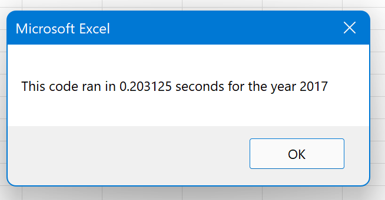
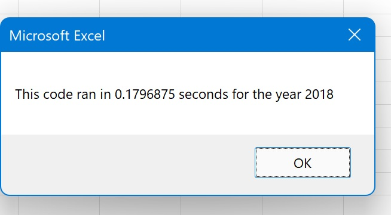

# Stock-analysis

## Overview of the Project
### Purpose
The purpose of this project is to refactor an Excel VBA file by adding more efficient steps in running the code from the original file so Steve can know which stocks are worth investing in based on 2017 and 2018 stock's volume and returns.   
### Background
The given data has a long list of stocks. Within it includes a total of 12 stocks, ticker value, date issued, the opening, the closing, and the adjusted prices, the highest and the lowest price and the volume treaded of 2017 and 2018. Steve wants to know which stocks would be a good investment. By using this project and VBA file, Steve can find out the yearly volume and the return percentage of the stocks so he can make a good judgment on investing.
## Result
### Analysis 
Below are the lines of code with comments/instructions that was written in the refactoring VBA file to do investment analysis. First inbox box was written so we have the option of which year of data we want to anaeg)
After running all of the codes shown above, we get the result showing which investment did well in 2017 and 2018. Since there is formatting, we can easily see which stock did well and did not. Stocks that did well were shown by a green cell (cell value > 0) and the stocks that didn't do well were shown by a red cell (cell value < 0).
.png)
.png)
## Summary
### Advantage and Disadvantage of Refactoring Code
The Advantage of Refactoring code is that it makes our code more organized and cleaner for the viewer to check the work. By having comments and breaking down step-by-step, it makes running the file more efficient and provides the reader better understanding. The disadvantage is that the detailed work means it is more time consuming. Since the comments were added already in the download file not much comments had to be written. However if one were refactoring a whole file, it would take time to design a step-by-step code and comments. 
The picture belows show how fast it takes to run the analysis with a click of a button with Refactoring code. Refactoring the code allows the end-user to get informations for data analysis with significantly less amount of time. However, the person who programs the code would need more time to create the file. 

